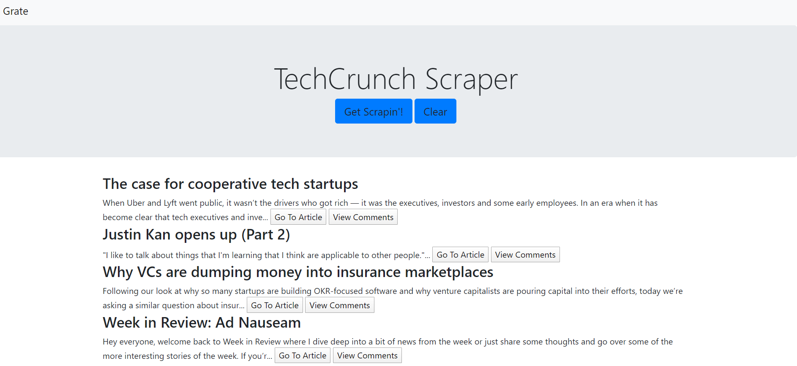
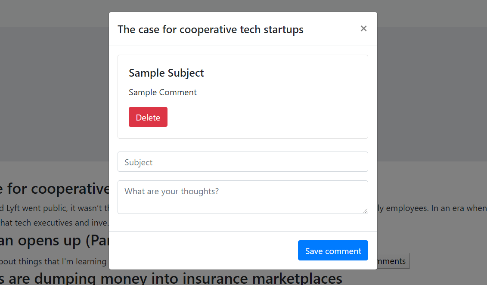

# Grate

All The News That's Fit To Scrape [Deployed on Heroku](https://frozen-chamber-40916.herokuapp.com/)

Grate is a web scraper that scrapes the latest articles from TechCrunch.

## Getting Started

Grate can be used to:

  * `Scrape the latest articles`

  * `Clear articles from the Grater homepage`

  * `View the original article on TechCrunch`

  * `Save, update, and delete a comment on an article.`

### Prerequisites

You will need to install the following to work on Grate:

```

   * [Express](npm i express)

   * [Cheerio](npm i cheerio)

   * [Morgan](npm i morgan)

   * [Axios](npm i axios)

   * [Mongoose](npm i mongoose)

   * [MongoDB]
   
```

### How To Use Grate

1. Go to the Heroku app
2. Click "Get Scrapin'!"

    **Homepage**

    

3. Click "Go To Article" to get taken to the original article.

4. Click "View Comments" to add, update, or delete a comment.

    **Comment Popup**

    

## Technologies

* Javascript
* Node.js
* Dependencies:
    * Express
    * Cheerio
    * Morgan
    * Axios
    * Mongoose
* ES6
* AJAX
* jQuery
* MongoDB
* Heroku

## Future Development

* Be able to save more than one comment
* Be able to save an article
* Better design

## Acknowledgments

* Instructor
* TAs
* Study Group 
    * Lazaro Perez
    * Felix Fernandez
    * Zekeriya Otumlu
 
